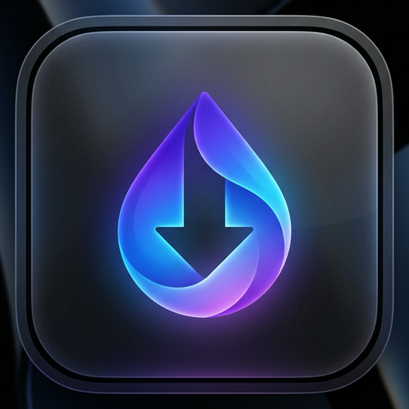
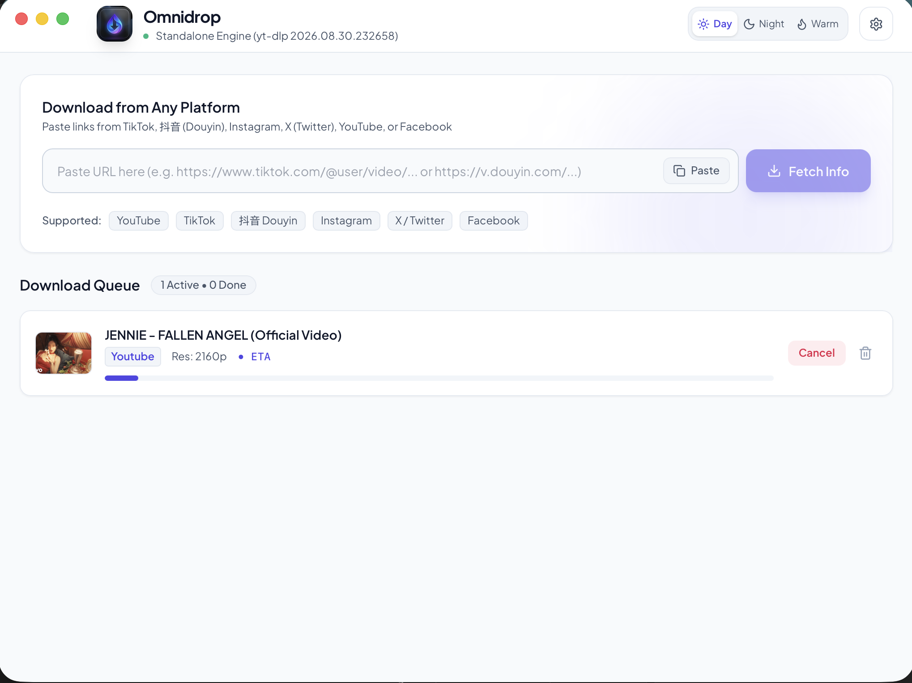

# Omnidrop

<div align="center">
  
  <h3>Modern, Fast, Standalone Social Media Downloader for macOS & Windows</h3>
  <p>Engineered with Go 1.26, Wails v2, React 18, and TailwindCSS.</p>

  <p>
    <a href="https://github.com/billy1030/downloader/releases/latest">
      
    </a>
    
    
  </p>

  <p align="center">
    
  </p>
</div>

---

> [!IMPORTANT]
> **Educational and Personal Research Disclaimer**
> 
> Omnidrop is created strictly for **educational, experimental, and personal learning purposes**. It serves as an architectural demonstration of integrating high-performance Go backend worker queues with modern embedded native web technology (WebKit on macOS, WebView2 on Windows via Wails v2) and open-source media extraction pipelines.
> 
> Users must respect the Terms of Service and Intellectual Property rights of all platforms and content creators. Do not use this tool to download copyrighted material without proper authorization.

---

## 📥 Download Pre-built Binaries

You can grab the latest standalone executables directly from the [Releases Page](https://github.com/billy1030/downloader/releases/latest):

| Operating System | Architecture | Package / File |
| :--- | :--- | :--- |
| **macOS** (Recommended) | Universal Bundle | [**Omnidrop-macOS.zip**](https://github.com/billy1030/downloader/releases/latest/download/Omnidrop-macOS.zip) *(Unzip and drag `Omnidrop.app` to Applications)* |
| **Windows** | 64-bit (`x86_64`) | [**Omnidrop-windows-amd64.exe**](https://github.com/billy1030/downloader/releases/latest/download/Omnidrop-windows-amd64.exe) |
| **macOS** (CLI / Binary) | Apple Silicon (`M1/M2/M3/M4`) | [**Omnidrop-darwin-arm64**](https://github.com/billy1030/downloader/releases/latest/download/Omnidrop-darwin-arm64) |
| **macOS** (CLI / Binary) | Intel (`x86_64`) | [**Omnidrop-darwin-x86_64**](https://github.com/billy1030/downloader/releases/latest/download/Omnidrop-darwin-x86_64) |

---

## 🍏 macOS Installation Guide

Follow these simple steps to install and run Omnidrop on macOS (Apple Silicon M1/M2/M3/M4 or Intel):

### Step 1: Download & Extract
1. Download [**Omnidrop-macOS.zip**](https://github.com/billy1030/downloader/releases/latest/download/Omnidrop-macOS.zip) from the latest release.
2. Double-click the downloaded zip file in your `Downloads` folder to extract **`Omnidrop.app`**.
3. Drag and drop **`Omnidrop.app`** into your **`/Applications`** folder.

### Step 2: First-Time Launch (Bypassing Gatekeeper)
Because Omnidrop is an open-source tool built without a paid Apple Developer certificate, macOS Gatekeeper may show a warning on first launch:

**Option A (GUI - Easiest)**:
1. Open your **Applications** folder in Finder.
2. **Right-click (or Control-click)** on `Omnidrop.app` and select **Open**.
3. Click **Open** in the confirmation dialog. You only need to do this once!

**Option B (Terminal - One-liner)**:
If macOS blocks or prevents opening, open Terminal and run:
```bash
xattr -cr /Applications/Omnidrop.app
```
Then double-click `Omnidrop.app` to launch normally anytime.

---

## 🌟 Key Features

- **Cross-Platform**: Full native support for **macOS** (Apple Silicon & Intel) and **Windows** (64-bit).
- **Multi-Platform Extraction**: Direct parsing and downloading for **TikTok**, **抖音 (Douyin)**, **Instagram**, **X (Twitter)**, **YouTube**, and **Facebook**.
- **Smart URL Normalization**: Automatically extracts canonical video IDs from complex search modal URLs (e.g. Douyin `/jingxuan/search/nova?modal_id=...`) and strips radio mix playlist pollution.
- **Concurrent Queue System**:
  - Independent worker pool with configurable concurrency (default: 3 simultaneous downloads).
  - Clean pause, resume, cancel, and dismiss actions.
  - Retains download history with quick **"Recent 5"** and **"All"** view toggles.
  - Direct **"Open"** (with default media player) and **"Show in Folder / Finder"** actions upon download completion.
- **JavaScript Challenge Solver**: Automatically hooks into system Node.js (`node`) for solving YouTube client signature and SABR bot detection challenges.
- **Beautiful Modern UI**:
  - 3 Crafted Themes: **Day** (Default), **Night**, and **Warm**.
  - Adaptive safe-area padding for macOS traffic lights (🔴 🟡 🟢) and Windows borderless titlebars.
  - Background clipboard auto-detection banner.

---

## 🍪 Managing Authentication & Cookies

Some platforms (such as YouTube with bot verification or age/member-restricted media) require valid session cookies to stream content. Omnidrop provides two methods to supply cookies:

### Method 1: Direct 1-Click Browser Session (Recommended)

Omnidrop can read session cookies directly from your local browser without needing to export files:
1. In Omnidrop, click the **Settings (Gear icon)** in the top right corner.
2. Under **Authentication / Cookies**, click any of the quick preset buttons:
   - `🌐 Chrome`
   - `🦁 Brave`
   - `🌊 Edge`
   - `🧭 Safari` (macOS)
3. Omnidrop will automatically extract the session token for the target URL directly from your browser profile.

---

### Method 2: Exporting Netscape `cookies.txt` Locally

If you prefer using an isolated cookie file:

#### Step 1: Install a Cookie Exporter Extension
Use an open-source, local-only Chrome / Firefox / Edge extension such as:
- **Get cookies.txt LOCALLY** ([Chrome Web Store](https://chromewebstore.google.com/detail/get-cookiestxt-locally/cclelndahbckbenkjhflpdbgdldlbecc))

> [!TIP]
> Ensure you use extensions that operate strictly on-device without sending cookie data to third-party servers.

#### Step 2: Export Cookies for the Desired Site
1. Log in to the service in your browser (e.g. [YouTube](https://www.youtube.com)).
2. Open the **Get cookies.txt LOCALLY** extension from your browser toolbar.
3. Click **Export** to save a file named `www.youtube.com_cookies.txt`.
4. *Important note on YouTube bot checks*: Because YouTube frequently rotates session tokens (`__Secure-1PSIDTS` / `__Secure-3PSIDTS`), ensure you do not log out of your browser session after exporting.

#### Step 3: Load Cookies into Omnidrop
1. Open Omnidrop **Settings**.
2. Click **Select .txt** under **Authentication / Cookies**.
3. Pick your exported `.txt` file. The path will be saved in your user preferences directory (`~/.omnidrop/config.json` on macOS or `%USERPROFILE%\.omnidrop\config.json` on Windows).

---

## 🛠️ Prerequisites & Building from Source

### Dependencies
- **Go**: `1.22+`
- **Node.js**: `v18+` (for JavaScript challenge solving)
- **FFmpeg**: Available in system `PATH`
- **yt-dlp**: Available in system `PATH`

### Building on macOS

```bash
# 1. Clone repository
git clone https://github.com/billy1030/downloader.git
cd downloader

# 2. Compile frontend and desktop binary
make build

# 3. Launch application
./bin/Omnidrop
```

### Building on Windows

```powershell
# 1. Install frontend dependencies and build
cd frontend
npm install
npm run build
cd ..

# 2. Compile desktop application with Wails
wails build -platform windows/amd64 -o Omnidrop-windows-amd64.exe
```

---

## 📜 License & Acknowledgements

- Powered by [yt-dlp](https://github.com/yt-dlp/yt-dlp) and [FFmpeg](https://ffmpeg.org/).
- Built with [Wails](https://wails.io/) (WebKit / WebView2).
- Released under the MIT License for educational and research purposes.
